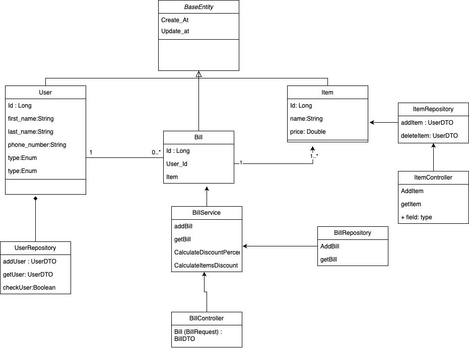
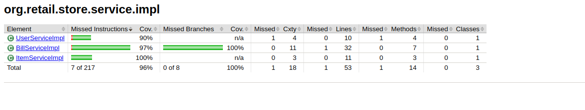
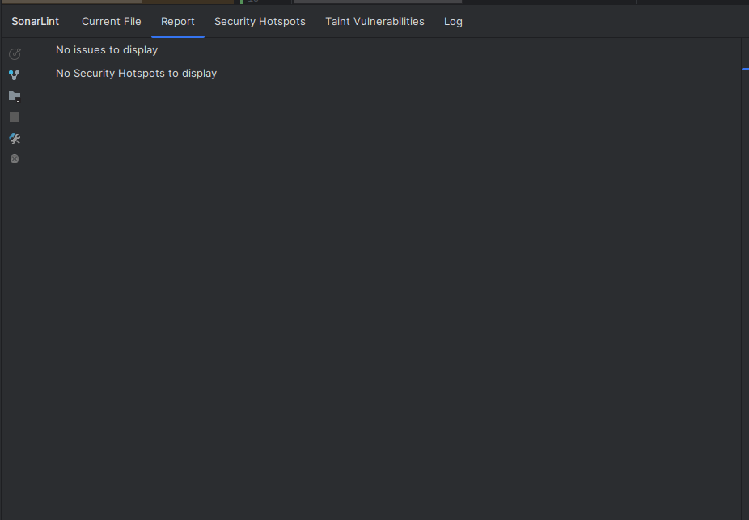

# retail-store

To run the application:

1. Install docker first on your machine [Docker Install](https://docs.docker.com/engine/install/)
2. Install docker compose [Docker-Compose](https://docs.docker.com/compose/install/)
3. run this command
> docker-compose up

### Swagger UI
You can access swagger ui from this like once you make your that the app is Up & Running
> http://localhost:8080/swagger-ui/index.html#/

### UML Class Digram

### Test Coverage
Here's the test coverage percentage on all the service using Jacoco plugin

### Sonar Lint reporting tools
I've used sonar lint as linting tool

